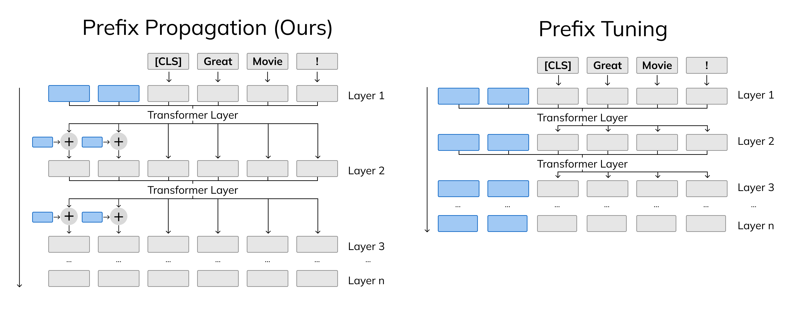

# prefix-propagation

Source code for ["Prefix-Propagation: Parameter-Efficient Tuning for Long Sequences"](https://aclanthology.org/2023.acl-short.120/) (published at ACL 2023 main conference). Codebase is based off [P-tuning-v2](https://github.com/THUDM/P-tuning-v2).

> Parameter-efficient tuning aims to mitigate the large memory requirements of adapting pretrained language models for downstream tasks. For example, one popular method, prefix-tuning, prepends trainable tokens to sequences while freezing the rest of the model’s parameters. Although such models attain comparable performance with fine-tuning when applied to sequences with short to moderate lengths, we show their inferior performance when modelling long sequences. To bridge this gap, we propose prefix-propagation, a simple but effective approach that conditions prefixes on previous hidden states. We empirically demonstrate that prefix-propagation outperforms prefix-tuning across long-document tasks, while using 50% fewer parameters. To further investigate the proposed architecture, we also show its advantage in calibration, and perform additional study on its relationship with kernel attention. To the best of our knowledge, this work is the first to focus on parameter-efficient learning for long-sequence language tasks.



## Setup

We recommend creating a new [conda](https://docs.conda.io/en/latest/) enviornment for this project. To do so, run the following commands:
```bash
conda create --name prop python=3.10
conda activate prop
```

Then, install torch with conda:
```bash
conda install pytorch torchvision torchaudio pytorch-cuda=11.7 -c pytorch -c nvidia
```

Finally, install the rest of the requirements:
```bash
pip install -r requirements.txt
```

## Usage

Training for prefix propagation can be done through the `run.py` script (make sure you have the conda environment activated). For easier configuration and easy grid hyperparameter search, see scripts in [`run_script`](./run_script/). For example, to train prefix-propgation with hyperparamter search on 20-newsgroups:
```bash
bash run_script/newsgroups_longformer_propagation.sh
```

### Wikihop Dataset Preparation

To use WikiHop, download data from [http://qangaroo.cs.ucl.ac.uk/](http://qangaroo.cs.ucl.ac.uk/) (can be done from command line with `gdown 1ytVZ4AhubFDOEL7o7XrIRIyhU8g9wvKA`). Then, unzip into `./data/`.

## Cite

```
@inproceedings{li-etal-2023-prefix,
    title = "Prefix Propagation: Parameter-Efficient Tuning for Long Sequences",
    author = "Li, Jonathan  and
      Aitken, Will  and
      Bhambhoria, Rohan  and
      Zhu, Xiaodan",
    booktitle = "Proceedings of the 61st Annual Meeting of the Association for Computational Linguistics (Volume 2: Short Papers)",
    month = jul,
    year = "2023",
    address = "Toronto, Canada",
    publisher = "Association for Computational Linguistics",
    url = "https://aclanthology.org/2023.acl-short.120",
    pages = "1408--1419",
}
```
